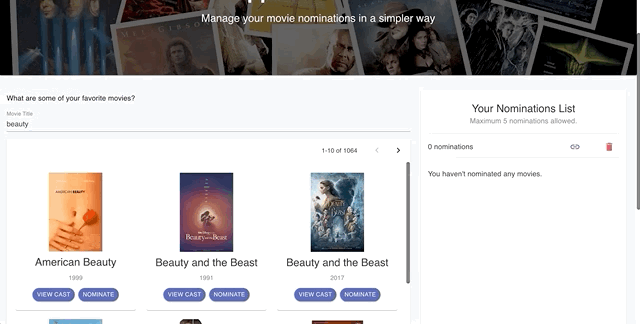
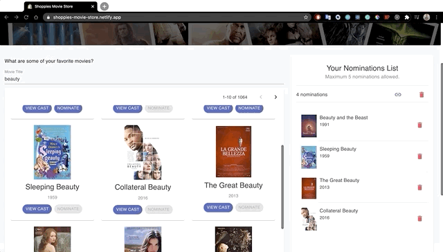

<h1 align="center">
  Shoppies Movie Store
 </h1>

<h3 align="center">
  An app to manage movie nominations for Shoppies. 
  <br> Shopify UX/Front-end Developer Internship Challenge Summer 2021
</h3>
<h3 align="center">
  <a href="https://shoppies-movie-store.netlify.app/">Check out the app here</a>
</h3>

## Contents 
- [Features](#features)
  * [React and Material-UI](#react-and-material-ui)
  * [Search Movie in Real-time](#search-movie-in-real-time-arrow_forward)
  * [Movie List Pagination](#movie-list-pagination-1234)
  * [View Movie Cast and Crew](#view-movie-cast-and-crew-couple)
  * [Movie List Animation](#movie-list-animation)
  * [Nomination List](#nomination-list-inbox_tray)
  * [Save Nomination List On Sessions](#save-nomination-list-on-sessions)
  * [Remove from Nomination List](#remove-from-nomination-list-exclamation)
  * [Shareable link](#shareable-link-paperclip)
- [Future Release Ideas](#future-release-ideas-scroll)
- [Developer Setup](#developer-setup-wrench)
- [Contact](#contact)

## Features 

### React and Material-UI 

The web app is built using React and [Material UI Components](https://material-ui.com/). React perfeclty suited my needs for this challenge and I used Material UI as they have lots of built-in customizable components and I'm familiar with the library. 

<br>
<div align="center">

</div>

### Search Movie in Real-time :arrow_forward:

You can search your movies in realtime. Just visit here and start searching for your favorite movie. This makes it easier for user to browse movies without having to press "Enter" button, which can be annoying for the user sometimes. 

<br>
<div align="center">

</div>

### Movie List Pagination :1234:

Since there are 581 movies:exclamation: for the word "fast" and lot more for others, I thought its better to have pages that user can browse through instead of a long list of movies. 

<br>
<div align="center">

</div>

### View Movie Cast and Crew :couple:

One of the important determining factors for nominating movies is the "Cast & Crew" of the movie. For solving this, I have a "View Cast" button which redirects the user to IMDB page with list of all the actors in the movie. 

<br>
<div align="center">

</div>

### Movie List Animation

Animations give a good user experience. Hence, I decided to add few animations to the nomination list so user can visualize movie "sliding" into their list. Also the movies appear scaled out. 

<br>
<div align="center">

</div>

### Nomination List :inbox_tray:

See a movie you like? You can add it to your list by clicking the "Nominate" button on each movie. 

<br>
<div align="center">

</div>

### Save Nomination List On Sessions

Your nominations are safe in the local storage! So don't worry if you close the tab or refresh it, they are not going to disappear. 

<br>
<div align="center">

</div>

### Remove from Nomination List :exclamation:

Did you add the wrong movie to your list? :x:  You can remove the movie from you list by clicking the "trash" icon near in the list item. But wait... do you want to discard the current list and add make a new one? Use the "trash" icon on top of the list to start fresh :repeat:

<br>
<div align="center">

</div>

### Shareable link :paperclip:

Share your nomination list with your friends today! Just click the "link" icon in your nomination list and a link will be copied to your clipboard. 

<br>
<div align="center">

</div>

## Future Release Ideas :scroll:

We could add a lot of features in the future to improve the user experience and usage of the platform. 
- Display more data in the cards like "rating" of the movie which is a very crucial aspect in choosing a movie. 
- Filters to search movies (like "New releases", "Oldest", "Sort by release year", "Search with a specific movie actor", sort by other aspects of the movie, etc.)
- API Request Cancellation can also be added so we can cancel the previous requests when user keeps on typing. This could be a very important feature when we want to scale the application and support lots of users.
- Store versions of the Nominations list or different types of nominations list for different movie genre.

## Developer Setup :wrench:

Clone the project/Download the files in the project

```
npm install
```
### Run the localhost
```
npm start
```
The website is ready to go! <br />

## Contact

Lets chat! Contact me at <br>
<br>:earth_americas: &nbsp; [utkarshpatadia.com](https://utkarshpatadia.com) <br>
<br>:inbox_tray: &nbsp; mindutkarsh@gmail.com <br>
<br>:necktie: &nbsp; [LinkedIn](https://www.linkedin.com/in/utkarsh-patadia-a291a7171/)

